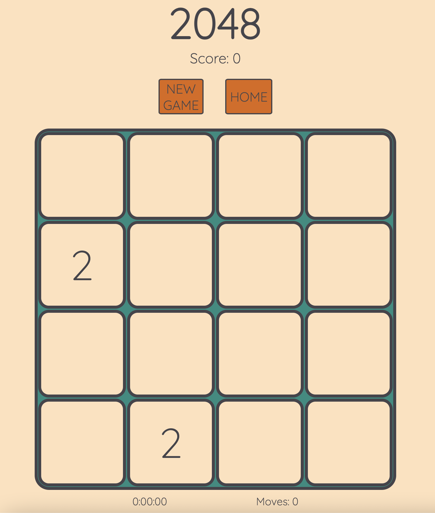
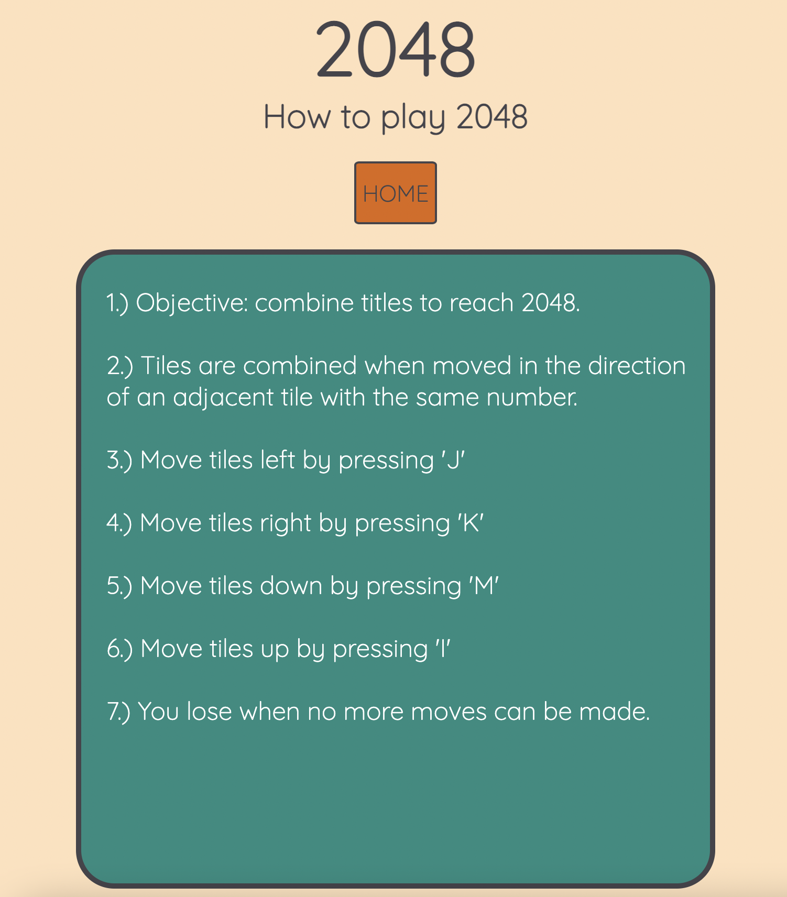

# 2048 Puzzle

## Date: 7/8/2022

---

### By: Joshua Langner

---

| [LinkedIn](https://www.linkedin.com/in/josh-langner-48) | [GitHub](https://github.com/jlangner87) |

---

Hosted Site [Surge](http://2048-numbergame.surge.sh)

### **_Description_**

#### This is a browser game written in JavaScript, CSS, and HTML. Users move numbered blocks around a playing grid- up, down, left, and right. When two blocks with the same number touch, they combine into one block and display the sum of the two numbers. Each move adds one more numbered block to the grid. When the user's blocks total 2048, they win. If they can make no more moves, they lose.

## **Future Development Opportunity**

### **Feature Bugs**

#### When shifting the tiles up or down, my function responds to the event listener and returns the correct array, I cannot figure out how to print it to the DOM.

#### I can have figured out how to isolate duplicate numbers in the arrays and return their sum, but I am adding all duplicate numbers in the row array.

### **'Lost Game' Alert**

#### When attempting to create a "lose" function that checks whether all indexes in the grid array, I kept getting an overflow error on the last click. Instead, the "lose" conditions are now set on the browser producing an alert when a console error is triggered. It serves its purpose, but this is not a best practice and needs to be changed.

### **'New Game' Button**

#### The new game button event listener calls a function that reloads the page. This is not industry standard, and I will be researching a way to start a new game without reloading the page.

### **'Undo' Button**

#### I have a plan to research and implement a feature that allows users to undo their previous move.

### **High Scores**

#### I have a plan to research and implement a “high-scores” page that will allow the top ten high scores to be permanently displayed.

### **Timer**

#### I have a plan to research and implement a functioning count-up timer that will display play time next to high scores.

## **_Trello Board_**

[Trello](https://trello.com/b/TnGyK7lh/browser-game-tbd)

### **_Technologies Used_**

- JavaScript
- CSS
- HTML

---

## **_Screenshots_**

### Sample Game Board

### HOW-TO

---

#### _Credits_

color palette sourced from [WixBlog](https://www.wix.com/blog/2016/05/colors-101-how-to-choose-the-right-website-color-schemes/)

drawBoard and populateBoard functions are based on logic from [Video](https://youtu.be/aDn2g8XfSMc)

.every Array method learned at [Mozilla](https://developer.mozilla.org/en-US/docs/Web/JavaScript/Reference/Global_Objects/Array/every)

.includes Array method learned at [Mozilla](https://developer.mozilla.org/en-US/docs/Web/JavaScript/Reference/Global_Objects/Array/includes)

window.onerror learned from [dotherightthing](https://gist.github.com/dotherightthing/cf0966bffc88abfec7af)

keydown event listenr learned from [Eloquent_JavaScript](https://eloquentjavascript.net/15_event.html)

---
